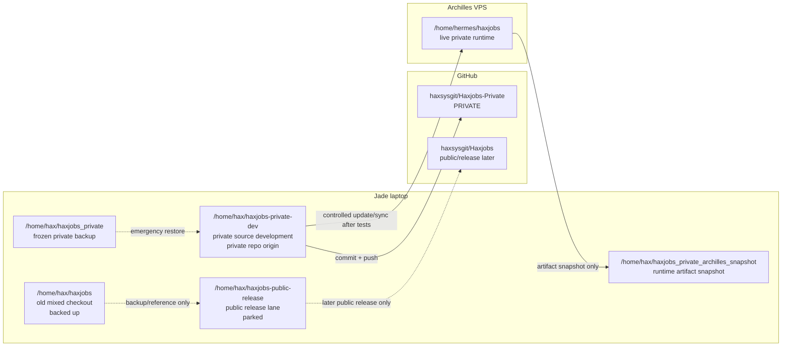

# HaxJobs Private Workflow Map

Status: active private workflow

## Rule

Private HaxJobs comes first. Public release work is separate and paused until the private pipeline works reliably for Arinze.

## Current lanes

```text
Jade laptop
├── /home/hax/haxjobs-private-dev
│   ├── role: private source development
│   ├── remote: https://github.com/haxsysgit/Haxjobs-Private.git
│   ├── allowed: private profile/CV source files
│   └── deploys to: /home/hermes/haxjobs on Archilles
│
├── /home/hax/haxjobs-public-release
│   ├── role: public scrub/package lane
│   ├── status: parked for now
│   └── must not sync to Archilles blindly
│
├── /home/hax/haxjobs
│   ├── role: old mixed checkout
│   ├── status: frozen/backed up before split
│   └── do not use as the default daily HaxJobs lane
│
├── /home/hax/haxjobs_private
│   ├── role: frozen private backup
│   └── not a development checkout
│
└── /home/hax/haxjobs_private_archilles_snapshot
    ├── role: private/generated artifact snapshot
    └── not a development checkout

Archilles VPS
└── /home/hermes/haxjobs
    ├── role: live private runtime
    ├── contains: state, intake, packs, reports, outreach, profile
    └── updated only from Jade private-dev after tests pass
```

## Mermaid diagram



## Normal private development flow

1. Work in:

```bash
cd /home/hax/haxjobs-private-dev
```

2. Check state:

```bash
git status --short
git branch --show-current
git remote -v
```

3. Run local verification before sending anything to Archilles:

```bash
python3 -m pytest -q
python3 -m py_compile $(find . -path './dashboard/node_modules' -prune -o -path './.git' -prune -o -path './.venv' -prune -o -name '*.py' -print)
bash -n cron/run_pipeline.sh scripts/haxjobs-update dashctl.sh build-dash.sh dev-watch.sh pack_builder.sh
cd dashboard && npx tsc -b --noEmit && npm run lint -- --quiet && npm run build
```

4. Commit private source changes to the private repo.

5. Update Archilles through the approved private sync/update path.

6. Health-check Archilles live runtime before considering the change done.

## Sync boundary

Allowed from private-dev to Archilles:

- source code
- scripts
- templates
- private profile/CV source files when intentionally changed
- dashboard source/build instructions

Not allowed by blind sync:

- deleting `state/`
- deleting `intake/`
- deleting `packs/`
- deleting `reports/`
- deleting `outreach/`
- running `rsync --delete` without explicit approval
- sending public-release scrub deletions to Archilles

## Public release rule

Do not resume public packaging/release work until the private workflow is stable and boring.

Public release work belongs in:

```text
/home/hax/haxjobs-public-release
```

Private daily development belongs in:

```text
/home/hax/haxjobs-private-dev
```
