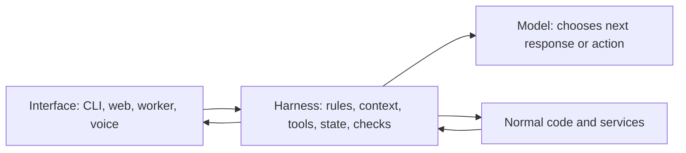

# Agent System Notes

This vault explains the software around a language model.

People call that software a **harness**. In plain terms, it decides what the model sees, what it may ask to do, what actually runs, what gets remembered, what needs proof, and what the user can inspect or approve.

Start with [[00-How-An-Agent-Actually-Runs]]. It builds the idea from one stateless model call into a full action loop.

The dependency direction matters. The interface uses the harness. The harness uses the model and tools. A new interface should not create another agent implementation.

## The twelve pieces

| # | Note | In simple words | Neutral example |
|---|---|---|---|
| 1 | [[01-instructions]] | Rules the model reads before work | Never quote a price without a current source |
| 2 | [[02-context-delivery-and-management]] | Put the right material in this turn | Load one invoice and the matching policy |
| 3 | [[02-context-delivery-and-management]] | Keep the model's desk clear | Compact old chat and limit giant tool results |
| 4 | [[03-tool-interface]] | Named actions the model may request | `get_invoice(invoice_id)` |
| 5 | [[04-execution-environment]] | Permission and containment around actions | Block payment without exact approval |
| 6 | [[05-durable-state]] | Data that survives the current process | Sessions, current facts, past decisions |
| 7 | [[06-orchestration]] | Order, checkpoints, retries, and stopping | Verify eligibility before creating a refund |
| 8 | [[07-sub-agents-and-skills]] | Separate workers for independent heavy tasks | Research three suppliers in parallel |
| 9 | [[07-sub-agents-and-skills]] | Saved procedures for repeated work | A refund-review recipe |
| 10 | [[08-verification-and-observability]] | Outside proof that a result is acceptable | Provider receipt confirms a refund |
| 11 | [[08-verification-and-observability]] | A record of what the run did | Tool calls, approvals, timing, and cost |
| 12 | [[09-evolution]] | Turn repeatable failures into tested changes | Fix a bad truncation rule and keep regression tests |

## How the Carbon Layer build maps onto the vault

The Carbon Layer video builds fifteen chapters because it also demonstrates the foundation and interface around the twelve primitives.

| Video stage | Vault home |
|---|---|
| Bare model and message history | [[00-How-An-Agent-Actually-Runs]] |
| Instructions | [[01-instructions]] |
| Context delivery and compaction | [[02-context-delivery-and-management]] |
| Tools and the action loop | [[03-tool-interface]] |
| Sandbox, scope, secrets, approvals | [[04-execution-environment]] |
| Durable sessions and retrieval | [[05-durable-state]] |
| Planning and workflow control | [[06-orchestration]] |
| Skills and sub-agents | [[07-sub-agents-and-skills]] |
| Verification and tracing | [[08-verification-and-observability]] |
| UI as a consumer of the same core | [[00-How-An-Agent-Actually-Runs]] |
| Improvement after repeated failure | [[09-evolution]] |

The code examples in these notes come from `~/gemma`, the repository used in the video. They are short implementation lenses, not a blueprint for every agent. File tools, shell execution, Git worktrees, and test commands are coding-agent examples of general ideas.

## How the pieces connect

![[diagrams/png/how-the-pieces-connect.png]]

Editable source: [[diagrams/how-the-pieces-connect.drawio]].

Read it from the centre out:

- the model chooses the next move using selected rules and context
- tools turn requests into narrow actions
- execution checks decide what may really run
- memory, skills, and workers support the run
- verification and traces keep the result honest and debuggable
- repeated failures can later become tested system changes

## Source material

Main practical consolidation:

- [The Carbon Layer: Building an AI Agent From Scratch in Python, One Primitive at a Time](https://youtu.be/oUBgqzcV1qw)
- Local teaching repository: `~/gemma`

The vault also includes material from focused lessons on context management, skills, agent memory, and controlled self-improvement.

## How to use this vault

Read [[00-How-An-Agent-Actually-Runs]] first, then move through the numbered notes.

You can also start from a failure:

- forgot after restart: [[05-durable-state]]
- received the wrong information: [[02-context-delivery-and-management]]
- requested a risky action: [[04-execution-environment]]
- repeated or skipped steps: [[06-orchestration]]
- claimed success without proof: [[08-verification-and-observability]]
- keeps failing the same way: [[09-evolution]]

Open [[Harness-Primitives.canvas]] for a click-through map.
