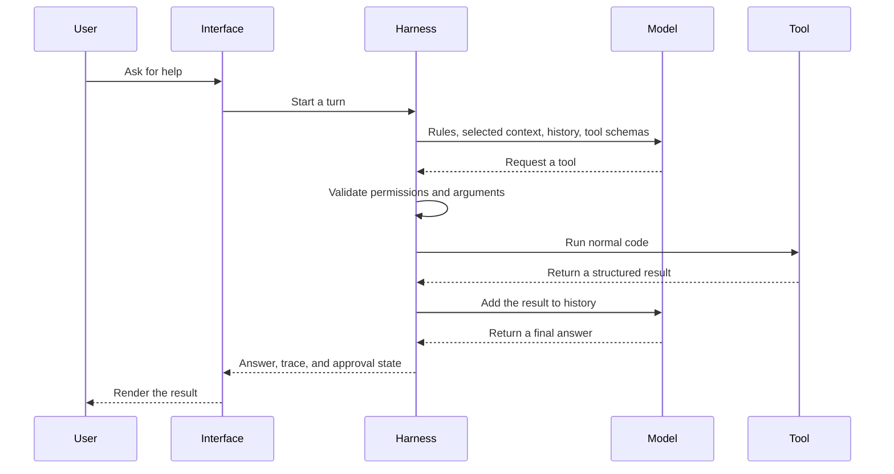

# How an Agent Actually Runs

Before splitting the system into twelve pieces, get the basic machine straight.

A language model receives messages and predicts what should come next. It does not wake up with yesterday's conversation in its head. It does not directly read a database, search the web, approve a payment, or send an email.

The surrounding software does those jobs.

People call that surrounding software a **harness**. In normal words, it is the code that decides:

- which rules the model receives
- which information is relevant now
- which actions the model may request
- whether those actions are allowed
- what survives after this call
- what counts as proof
- what the user can see and approve

The Carbon Layer video reduces the whole system to three layers:

```text
interface -> harness -> model
```

The interface might be a CLI, website, mobile app, voice assistant, or background worker. The harness owns the actual run. The model chooses the next move.

## Start one rung lower: one model call

A bare model call is basically this:

```python
messages = [
    {"role": "user", "content": "My name is Ada."},
]

reply = model.chat(messages)
print(reply.text)
```

Call the model again with only `"What is my name?"` and it may not know. The first call ended. Nothing inside the model carried Ada into the second call.

This is why a chat window can look continuous while the API underneath is stateless.

## Conversation history is replay

To make the second turn remember the first, your program keeps the messages and sends them again.

```python
messages.append({"role": "assistant", "content": reply.text})
messages.append({"role": "user", "content": "What is my name?"})

reply = model.chat(messages)
```

The model did not remember Ada by itself. Your program put the earlier exchange back on its desk.

That message list is **working history**. It is not yet durable memory. Restart the program and the list disappears unless you save it. See [[05-durable-state]].

## Then add actions

A useful agent run usually looks like this:



The model does not directly run the tool. It asks.

The harness validates the request, runs normal code, puts the result into the message list, and calls the model again. The loop ends when the model returns text instead of another tool request.

```python
def run_turn(user_message: str) -> str:
    messages.append({"role": "user", "content": user_message})

    while True:
        reply = model.chat(messages=messages, tools=tool_schemas)
        messages.append(reply.as_message())

        if not reply.tool_calls:
            return reply.text

        for tool_call in reply.tool_calls:
            result = dispatch(tool_call)
            messages.append(result.as_message())
```

That loop is the spine. Every other primitive improves one part of it.

## Why the video builds one piece at a time

Gemma tags each stage from `ch-00` to `ch-14`. The model barely changes. One surrounding capability is added, then demonstrated before the next one arrives.

That sequence is useful because failures stay attributable:

- Chapter 1 forgets because there is no message history.
- Chapter 4 cannot use a file until the harness delivers its contents.
- Chapter 5 can act because tools and dispatch now exist.
- Chapter 6 starts compacting because action results fill the window.
- Chapter 9 survives a restart because messages finally reach disk.

A finished framework hides those causal links. Building the thin version first makes each responsibility visible.

## From Gemma: keep the model behind one door

The Gemma teaching repo sends every model request through one function.

Simplified from `~/gemma/model/client.py`

```python
def chat(messages, *, tools=None, provider=None, on_delta=None):
    provider = provider or Provider.from_env()

    if provider.responder is not None:
        return provider.responder(messages, tools=tools)

    return complete_openai(
        provider,
        messages,
        tools=tools,
        on_delta=on_delta,
    )
```

Ignore the provider names for a second. The general lesson is simple: the rest of the system should call one stable model boundary. A local model, hosted API, or fake test model can sit behind that boundary without rewriting the agent loop.

The fake provider matters because you can test the loop deterministically. You should not need a paid API call to prove that a malformed tool request returns an error.

## The interface is a consumer, not the owner

Gemma begins with a plain terminal prompt and ends with a two-pane terminal UI. The inner agent does not get rewritten for the UI.

The final UI:

- sends user text to the same agent
- streams model output
- renders trace events
- asks the user to approve risky actions
- shows exact proposed changes

Simplified from `~/gemma/ui/tui.py`

```python
@work(thread=True, exclusive=True)
def _run_turn(self, text: str) -> None:
    reply = self.agent.send(text, on_delta=self._stream)
    self.call_from_thread(self._turn_done, reply)
```

The Textual decorator is specific to that terminal framework. The useful rule is broader:

```text
interface calls harness
harness calls model and tools
harness never imports the interface
```

That is how one agent can later support a CLI, web app, scheduled worker, or messaging connector without growing four different brains.

## Where the twelve pieces fit

| Piece | What it adds | Note |
|---|---|---|
| Instructions | Stable rules and task policy | [[01-instructions]] |
| Context delivery | The information needed for this turn | [[02-context-delivery-and-management]] |
| Context management | Selection, limits, and compaction | [[02-context-delivery-and-management]] |
| Tools | Named actions the model may request | [[03-tool-interface]] |
| Execution environment | Permission checks and containment | [[04-execution-environment]] |
| Durable state | Sessions, facts, and past events | [[05-durable-state]] |
| Orchestration | Plans, order, retries, and checkpoints | [[06-orchestration]] |
| Sub-agents | Separate workers with separate context | [[07-sub-agents-and-skills]] |
| Skills | Saved procedures loaded when needed | [[07-sub-agents-and-skills]] |
| Verification | External proof for important claims | [[08-verification-and-observability]] |
| Observability | A record of what happened | [[08-verification-and-observability]] |
| Evolution | Turning repeated failures into tested changes | [[09-evolution]] |

## One non-coding example

Imagine a travel agent asked to book a flight.

1. The interface receives the request.
2. The harness loads travel preferences and passport constraints.
3. The model requests a flight search tool.
4. Normal code searches approved providers.
5. The result returns to the model.
6. The model proposes one option.
7. The harness stops at a payment approval gate.
8. The interface shows the exact price and cancellation terms.
9. Only the user's approval can release the booking tool.

Same loop. Different tools and evidence.

## HaxJobs case study

For HaxJobs, the interface could be a CLI, web app, or cloud worker. The harness should still own the same run: load one career track, select relevant evidence, expose career tools, record decisions, and stop before external actions that need approval.

The interface changes. The product actions and safety rules should not.

## In plain English

- A model call is stateless unless your program resends history.
- The harness owns the messages, tools, permissions, saved state, checks, and run loop.
- The model proposes the next move. Normal code performs allowed actions.
- The interface displays and supervises the same core instead of rebuilding it.
- Most of what makes an agent useful lives around the model, not inside its weights.
