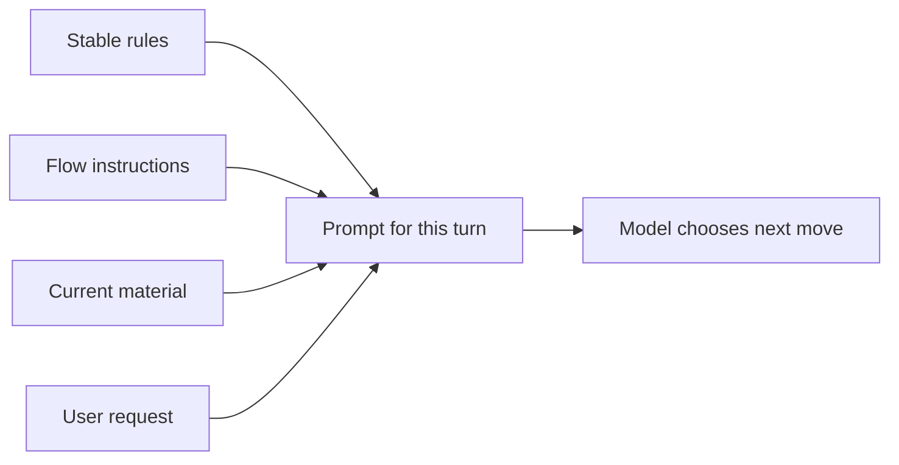
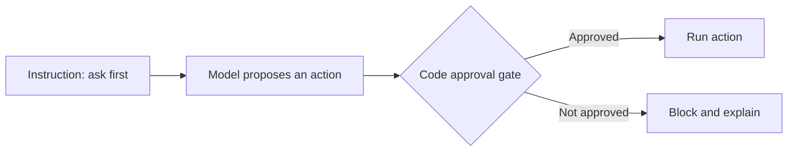

# Primitive 1: Instructions

## The note the model reads before work starts

A model does not join your product already knowing its job, rules, or safety limits.

Instructions tell it:

- what role it has
- what outcome it should aim for
- what rules stay true across turns
- what it must never pretend to know
- when it should use a tool or ask for approval

```python
system_prompt = """
You help users compare travel options.
Never invent prices or visa rules.
Use live search for current availability.
Never book or pay without explicit approval.
"""
```

That text shapes the model's choices. It does not give the model new abilities, save memory, or enforce a payment block.

## Useful rules remove guessing

This is weak:

```text
Be helpful. Make good choices.
```

What counts as good? Can the model guess missing facts? Can it contact someone? Should it check a database first?

This is clearer:

```text
Use saved customer facts only when their source is known.
Check live availability before quoting a price.
You may prepare a booking, but only the user can approve payment.
If a required fact is missing, ask for it.
```

Good instructions name decisions that would otherwise be guessed.

## Keep three kinds of material separate

| Layer | What belongs there | How often it changes |
|---|---|---|
| Stable | Identity, safety, truth rules | Rarely |
| Flow | Rules for this kind of task | Per workflow |
| Current | User request and selected facts | Every turn |



A stable instruction might say, "Never invent evidence." A flow instruction might explain how to evaluate one job. The current material contains the actual profile slice and job.

Mixing all three into one giant prompt makes updates harder and weakens caching. It also makes it easier for current data to look like permanent policy.

## Loading instructions from the current workspace

Sometimes one system runs inside several projects, teams, or customer spaces. Each space may need extra local rules.

Gemma loads a known instruction file when it exists.

Simplified from `~/gemma/harness/instructions.py`

```python
def load_agents_md(directory: str | Path = ".") -> str:
    path = Path(directory) / "AGENTS.md"
    return path.read_text() if path.is_file() else ""
```

The filename is specific to coding tools. The pattern is general:

```text
base product rules
+ trusted workspace rules
+ current workflow rules
```

A healthcare agent might load clinic policy. A support agent might load a customer's escalation rules. A career agent might load evidence and approval rules for application work.

The important bit is trust. Local instruction files should extend the product's fixed safety rules, not replace them. Untrusted documents belong in context as data, not in the high-priority instruction layer.

## From Gemma: build the instruction layer deliberately

Gemma assembles its system text from three optional pieces.

Simplified from `~/gemma/harness/agent.py`

```python
def _system_text(self) -> str:
    parts = [
        part
        for part in (
            self.system,
            load_agents_md(self.agents_dir),
            skills_prompt(self.skills),
        )
        if part
    ]
    return "\n\n".join(parts)
```

This is small, but it makes ownership visible:

- `self.system` is the built-in product policy
- the workspace file adds local rules
- the skill menu advertises optional procedures

In a larger system, you would also define precedence and reject local rules that attempt to weaken fixed safety policy.

## Instructions are not enforcement

You can write, "Never send an email without approval." That is useful guidance.

But if the send function is freely available, the safety rule still depends on the model behaving perfectly.



Use the right layer for the right job:

- instructions describe expected behaviour
- [[03-tool-interface|tools]] define available actions
- [[04-execution-environment|execution checks]] enforce permissions
- [[05-durable-state|durable state]] saves facts
- [[08-verification-and-observability|verification]] checks important claims

## HaxJobs case study

HaxJobs needs a stable rule like:

```text
Only use career claims supported by profile evidence.
Never submit an application or send outreach without explicit approval.
```

An evaluation flow can then add:

```text
Compare one stored job with the matching career track.
Separate evidence-backed matches from unsupported claims.
Return gaps as things the user can work on.
```

The job description and profile are current context, not permanent instructions.

## In plain English

- Instructions are the operating note the model reads before a turn.
- Keep stable rules, workflow rules, and current facts separate.
- Trusted local rules may extend the base policy, but should not weaken it.
- A prompt guides the model. Code must enforce anything that protects users or data.
