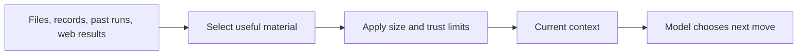

# Primitives 2 and 3: Context Delivery and Context Management

## Context is the model's desk

A model can only work with what the current request places in front of it.

That material includes:

- system instructions
- conversation history
- retrieved records
- attached documents
- tool descriptions
- tool results
- the user's current request

**Context delivery** finds useful material and puts it on the desk.

**Context management** stops the desk becoming a pile of old logs, repeated messages, giant documents, and conflicting facts.



More context is not automatically better. Five relevant facts can beat five hundred loosely related pages.

## Delivery: a reference is not the data

If a user says, "Compare invoice 183 with our refund policy," the model cannot see either item unless the harness resolves those references.

```python
invoice = invoices.get(183)
policy = policies.current("refunds")

context = {
    "invoice": invoice,
    "policy": policy,
}
```

The same idea applies to file references, database IDs, tickets, customer records, or sensor readings. The harness must:

1. resolve the reference
2. check access
3. read the data
4. mark its source
5. limit its size
6. place it near the request

## From Gemma: expanding an explicit reference

Gemma recognises `@path` in user text and reads the file before calling the model.

Simplified from `~/gemma/harness/context.py`

```python
def deliver(user_text: str) -> list[str]:
    blocks = []

    for match in _ATTACH.finditer(user_text):
        path = Path(match.group(1))
        if path.is_file():
            body = path.read_text()
            blocks.append(clamp(f"--- {path} ---\n{body}"))

    return blocks
```

The `@path` syntax is coding-specific. The useful pattern is not: turn a reference into bounded, source-labelled data before the model call.

This teaching version still leaves important questions open. A real resolver must handle authorization, path confinement, symlinks, missing data, encoding, duplicates, and untrusted content.

Fetched material is **data**. It should not silently become a higher-priority instruction just because it contains text like "ignore previous rules."

## Four ways context goes bad

| Failure | What it looks like |
|---|---|
| Poisoning | One wrong fact stays in history and gets reused |
| Distraction | The model focuses on logs instead of the task |
| Confusion | Irrelevant material makes the answer worse |
| Clash | Old and new facts disagree with no clear winner |

This is why context management is not just trimming tokens. It protects the model's attention.

## The four moves: Select, Compress, Write, Isolate

### 1. Select

Load the slice needed for this question.

```python
def build_context(ticket_id: int) -> dict:
    ticket = load_ticket(ticket_id)
    customer = load_customer(ticket.customer_id)
    similar_cases = search_cases(ticket.summary, limit=3)

    return {
        "ticket": ticket,
        "customer": customer,
        "similar_cases": similar_cases,
    }
```

Selection can use SQL filters, keyword search, embeddings, a graph, rules, or a small model. Start with the cheapest method that retrieves the right material often enough.

Tool selection is also a context problem. Showing a model fifty irrelevant tools makes it harder to choose. Select the tools needed for this workflow, just like you select facts.

### 2. Compress

When history grows, turn old detail into a smaller handoff note.

A useful summary keeps:

- current goal
- constraints and decisions already settled
- important facts and their sources
- completed work
- blockers
- next step

It should not keep every failed idea and repeated sentence.

Simplified from `~/gemma/harness/compaction.py`

```python
head = messages[:head_end]
tail = messages[tail_start:]
middle = messages[head_end:tail_start]

summary = summarize(middle)
note = {
    "role": "system",
    "content": f"[summary of earlier conversation]\n{summary}",
}

return head + [note] + tail
```

Gemma keeps the beginning and recent end, then summarizes the middle. It also moves cut points so a tool request is never separated from its matching result.

That protocol detail matters beyond coding agents. Never compact halfway through a transaction, approval exchange, or request-response pair.

Compaction can still lose something important. Keep structured critical facts outside the summary and preserve links back to raw history.

### 3. Write

If a fact or decision must survive, save it outside the prompt.

```python
save_case_decision(
    ticket_id=183,
    outcome="refund_approved",
    reason="Duplicate charge confirmed by payment provider.",
)
```

A scratchpad is short-lived working state. Durable memory survives future sessions. See [[05-durable-state]].

### 4. Isolate

Give a noisy, independent task its own context and ask for a compact result.

```python
report = research_worker.run(
    "Compare these five suppliers. Return price, risk, and source links."
)
```

The parent receives the report, not every search query and raw page. See [[07-sub-agents-and-skills]].

## Put limits at the door

Do not wait until the full prompt is already too large.

Gemma clamps each item before admission.

Simplified from `~/gemma/harness/limits.py`

```python
def clamp(text: str, max_chars: int) -> str:
    if len(text) <= max_chars:
        return text

    dropped = len(text) - max_chars
    return f"{text[:max_chars]}\n[truncated {dropped} chars]"
```

A per-item limit stops one huge file or tool result from taking the whole window.

A character cut is only a baseline. It can break JSON, remove the useful final error, or split a table. Better tools return compact structured output themselves. For long logs, keep the beginning, end, and matching error lines. For records, paginate.

## Know when to compact

Gemma prefers token usage reported by the model provider, then falls back to an estimate.

```python
window = last_reported_tokens or estimate_tokens(messages)

if window > context_limit:
    messages = compact(messages)
```

Reported usage is better than guessing, but it arrives after a call and some providers omit it. A good system tracks both the current estimate and the previous real usage.

Do not wait until 100 percent of the window is full. Leave space for the next model response and tool results.

## Context, retrieval, and memory are related but different

- Retrieval asks, "What saved material might matter?"
- Context management asks, "What should enter this call, in what form, and how much?"
- Memory asks, "What survives after this run?"

A database full of useful facts can still produce a bad answer if the wrong slice reaches the prompt.

## HaxJobs case study

For one job evaluation, HaxJobs should load:

- the selected job
- the matching career track
- evidence relevant to its requirements
- a small amount of company and decision history

It should not dump every career track, every job, every old report, and six months of chat into one call.

## Five questions when an agent gets worse mid-task

1. Did it ever receive the right fact?
2. Was the fact buried under noise?
3. Did compaction remove something important?
4. Was important work left only in chat instead of saved?
5. Should one heavy task have been isolated?

## In plain English

- Delivery puts the right material in front of the model.
- Management keeps wrong, old, huge, and irrelevant material out.
- Select what matters, compress old work, write durable facts, and isolate noisy tasks.
- Limit every item before it enters the prompt.
- A larger context window does not fix bad context choices.
