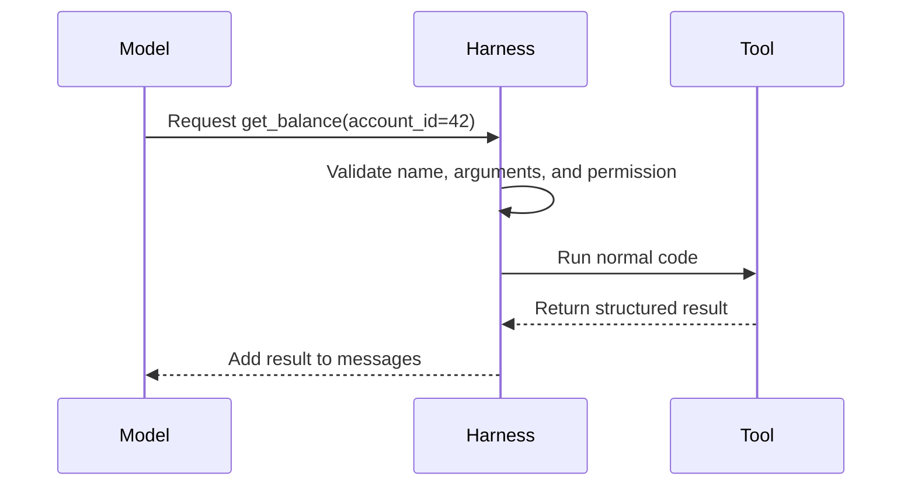

# Primitive 4: Tool Interface

## A tool is one action the model may request

A model can say, "I should check the current balance." That sentence does not check anything.

A tool connects a model request to normal code.



The model proposes the action. The harness owns dispatch and permission. The function does the real work.

## A tool is a contract plus an implementation

A good contract tells the model:

1. the tool name
2. when to use it
3. required inputs
4. input types and limits
5. result shape
6. possible failures

```python
get_balance_schema = {
    "name": "get_balance",
    "description": "Read the current balance for one account.",
    "parameters": {
        "type": "object",
        "properties": {
            "account_id": {"type": "integer"},
        },
        "required": ["account_id"],
    },
}
```

The implementation stays normal code:

```python
def get_balance(account_id: int) -> dict:
    account = accounts.find(account_id)

    if account is None:
        return {
            "ok": False,
            "code": "not_found",
            "error": "Account does not exist.",
        }

    return {
        "ok": True,
        "data": {"balance": account.balance},
    }
```

Structured results are easier for the model and easier for ordinary callers. A CLI, API route, scheduled worker, and agent tool can all use the same action.

## From Gemma: one registry owns both halves

Gemma stores the model-visible contract beside the callable function.

Simplified from `~/gemma/harness/tools.py`

```python
@dataclass
class Tool:
    name: str
    description: str
    parameters: dict
    func: Callable[..., str]


class ToolRegistry:
    def register(self, tool: Tool) -> None:
        self._tools[tool.name] = tool
```

The registry can advertise schemas:

```python
def specs(self) -> list[dict]:
    return [
        {
            "type": "function",
            "function": {
                "name": tool.name,
                "description": tool.description,
                "parameters": tool.parameters,
            },
        }
        for tool in self._tools.values()
    ]
```

And dispatch a requested name:

```python
def call(self, name: str, arguments: str) -> str:
    tool = self._tools.get(name)

    if tool is None:
        return f"error: unknown tool {name!r}"

    args = json.loads(arguments) if arguments else {}
    return str(tool.func(**args))
```

The exact error strings are a teaching shortcut. A product should validate against the schema and return typed error objects. The general boundary is right: schemas tell the model what exists; the registry decides what code a name actually reaches.

## The tool loop

The loop keeps calling the model until it returns normal text or hits a step budget.

Simplified from `~/gemma/harness/agent.py`

```python
for _ in range(MAX_TOOL_STEPS):
    reply = chat(messages, tools=registry.specs())

    if not reply.tool_calls:
        messages.append({"role": "assistant", "content": reply.content})
        return reply.content

    messages.append({
        "role": "assistant",
        "content": reply.content or "",
        "tool_calls": reply.tool_calls,
    })

    for tool_call in reply.tool_calls:
        name = tool_call["function"]["name"]
        arguments = tool_call["function"]["arguments"]
        result = registry.call(name, arguments)
        messages.append({
            "role": "tool",
            "tool_call_id": tool_call["id"],
            "content": result,
        })

return "error: exceeded tool-step budget"
```

A step budget stops a broken loop from calling tools forever. Exhaustion should be recorded as a real run state, not disguised as success.

## Small tools beat vague super-tools

This is hard to describe and hard to protect:

```text
manage_customer_request(request)
```

These are easier to reason about:

```text
get_customer(customer_id)
list_open_orders(customer_id)
create_refund_draft(order_id, reason)
approve_refund(draft_id, approval_id)
```

Small tools make side effects visible. They also let you give different workflows different tool lists.

## Risk belongs in the contract

| Type | Example | Normal treatment |
|---|---|---|
| Read | Read one record | Validate identity and scope |
| Internal write | Save a decision | Validate input and log change |
| External side effect | Send, buy, publish, submit | Require exact approval |

Gemma marks file writes and shell commands as approval-required while allowing its calculator directly. If no approval function exists, the action is denied.

That is the right default: no approver means no risky action.

The actual enforcement belongs in [[04-execution-environment]].

## Tools are not skills

A tool is one verb: `get_balance(42)`.

A [[07-sub-agents-and-skills|skill]] is a saved procedure explaining when and how to combine several verbs.

Keep the tool contract narrow. Put multi-step method guidance in a skill or fixed workflow.

## HaxJobs case study

A useful HaxJobs tool accepts an ID and loads its own trusted record:

```text
evaluate_fit(job_id)
record_decision(job_id, decision, reason)
generate_pack(job_id)
```

Passing raw job text into every action would make validation and provenance weaker. The stored ID gives the tool a known source of truth.

## In plain English

- A tool is a named contract connected to normal code.
- The model sees the schema, requests a call, then reads the result.
- The harness validates and dispatches. The model does not call arbitrary functions.
- Keep tools small, typed, and explicit about side effects.
- Cap the loop and fail closed when approval is missing.
