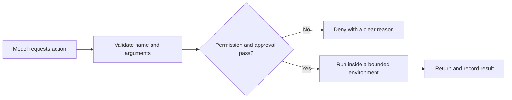

# Primitive 5: Execution Environment

## The model asks. This layer decides what really happens.

A [[03-tool-interface|tool schema]] tells the model which action it may request.

The execution environment decides:

- whether the caller may use that action
- which data or files it may touch
- which credentials it receives
- whether network access is allowed
- how long it may run
- how much output it may produce
- whether a person must approve it



Instructions say what good behaviour looks like. This layer makes important limits real.

## Start closed

A safe default gives untrusted work as little authority as possible:

- no inherited credentials
- no network unless required
- no access outside the assigned data scope
- no external side effect without approval
- a time limit
- memory and process limits where possible
- bounded output

Open one capability at a time when the workflow proves it needs it.

This applies beyond code execution. A finance agent might receive read access to one account but no transfer token. A support agent might draft a refund but not release it.

## Path checks need real containment

This is unsafe:

```python
if file_path.startswith(allowed_root):
    return read(file_path)
```

`/data/customer-evil/file.txt` starts with `/data/customer`. Symlinks can also point outside the visible folder.

Gemma resolves both the root and candidate path, then checks the resolved parent chain.

Simplified from `~/gemma/harness/workspace.py`

```python
def _safe(self, path: str) -> Path:
    candidate = (self.root / path).resolve()

    if candidate != self.root and self.root not in candidate.parents:
        raise ValueError(f"path escapes workspace: {path}")

    return candidate
```

The coding example uses files. The general rule is scope after resolution, not before. Resolve the real customer, tenant, account, record, URL, or path before authorizing access.

## Approval must describe the exact action

"Allow email" is too broad.

A useful approval binds to the exact proposed effect:

```text
Recipient: customer@example.com
Subject: Refund approved
Body: ...
Attachment: none
```

If any of those fields change, the old approval should not apply.

```python
def run_tool(tool_call, approval) -> dict:
    if tool_call.requires_approval:
        if not approval.matches(tool_call):
            return denied("approval_required")

    return execute(tool_call)
```

Approval records consent. It does not make an unsafe execution backend safe.

## Isolation is a ladder

Different work needs different containment.

| Boundary | What it gives | Important limit |
|---|---|---|
| Restricted application function | Small typed action | Function may still contain bugs |
| Scrubbed subprocess | Clean environment and timeout | Can still reach host filesystem/network |
| Container or OS sandbox | Stronger process and filesystem boundary | Shares host kernel and configuration matters |
| User-space kernel or microVM | Smaller blast radius | More operational cost |
| Separate machine/account | Strong isolation and credentials | Slowest and most expensive |

Pick based on damage potential, not what looks impressive in an architecture diagram.

## From Gemma: one execution choke point

Gemma's Docker backend removes several capabilities at once.

Simplified from `~/gemma/harness/sandbox.py`

```python
argv = [
    "docker", "run", "--rm",
    "--network", "none",
    "--user", "65534:65534",
    "--cap-drop", "ALL",
    "--memory", "256m",
    "--pids-limit", "128",
    "--read-only",
    "-w", "/work",
    image,
    "sh", "-c", command,
]
```

The exact flags are coding-agent details. The general checklist is useful:

- identity: who does the action run as?
- connectivity: what can it contact?
- capabilities: what host powers does it inherit?
- storage: what can it read and write?
- resources: how much time, memory, and process count?
- lifetime: can it outlive the request?

Gemma also has a local subprocess fallback. Its own source calls that fallback teaching-grade, not a security boundary. That honesty matters. Scrubbing environment variables and setting a timeout does not isolate the host filesystem or network.

For high-risk work, absence of the secure backend should mean refusal, not a quiet downgrade.

## Secrets should not enter the room

The strongest protection against secret leakage is not telling the model to behave. It is withholding the secret.

```python
safe_environment = {
    "PATH": "/usr/bin:/bin",
    "HOME": temporary_directory,
}
```

A tool should receive the narrow credential needed for one action, ideally through a service boundary that never reveals the raw secret to the model or child process.

## Output is part of the boundary

A tool that returns ten megabytes can damage context quality even if it cannot damage the filesystem.

Bound:

- execution time
- result rows
- response bytes
- redirect count
- retries
- child processes

This connects directly to [[02-context-delivery-and-management]].

## HaxJobs case study

HaxJobs should let normal product flows read profile evidence, evaluate stored jobs, create drafts, and record decisions.

Raw SQL, arbitrary shell, message sending, and application submission should not appear in normal tool modes. Sending or submitting must stop at an exact user approval gate.

## In plain English

- A tool request is a proposal, not permission.
- Start with no authority, then grant only what the action needs.
- Resolve real paths and record scope before authorizing access.
- Bind approval to the exact effect.
- A local subprocess is not a sandbox just because it has a timeout.
- If a strong boundary is required and unavailable, fail closed.
