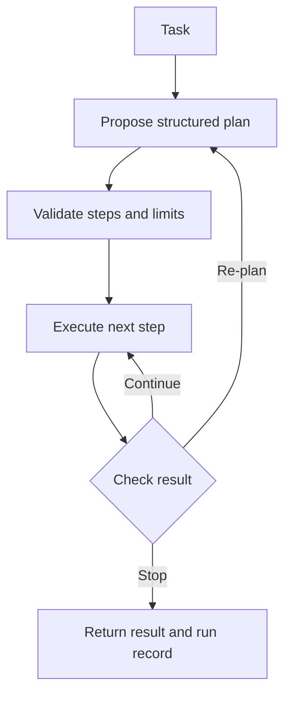

# Primitive 7: Orchestration

## It means managing work through time

A tool is one action. An agent loop lets the model choose several actions.

Orchestration is the controller around that loop. It decides:

- whether a task needs a plan
- which step runs first
- which steps may run together
- where approval is required
- what gets retried
- what gets saved
- when to stop or re-plan



The model may help propose the plan. Normal code owns the workflow state.

## Fixed workflow and agent choice can coexist

Use fixed code when skipping a step would be dangerous or corrupt data.

```python
def refund_order(order_id: int, approval_id: str) -> dict:
    order = load_order(order_id)
    verify_refund_eligibility(order)
    verify_approval(approval_id, order)
    result = payment_provider.refund(order.payment_id)
    save_refund_result(order_id, result)
    return result
```

Use model choice inside a safe area when judgment helps, such as deciding which evidence to inspect or which permitted search to run next.

```text
fixed setup -> bounded agent work -> fixed verification -> approval gate
```

You do not need to turn every request into a workflow graph. Ordinary questions can use the normal agent loop. Planning has cost and can make simple work slower.

## From Gemma: a control plane around the same agent

Gemma asks the model for a small JSON list of steps.

Simplified from `~/gemma/harness/orchestrator.py`

```python
text = chat(
    [
        {"role": "system", "content": PLANNER_RULES},
        {"role": "user", "content": task},
    ],
    max_tokens=400,
).content

steps = parse_plan(text)
```

Then normal code runs the steps in order.

```python
results = []

for step in steps:
    if not approve(step):
        results.append(f"[skipped] {step}")
        continue

    results.append(run_with_retry(worker, step))
```

The useful split is:

- planner proposes
- controller validates
- worker executes
- approval decides
- run state records

Gemma falls back to treating the whole task as one step when plan parsing fails. That keeps a planning failure from destroying a task that did not really need a plan.

## Plans are untrusted input too

Valid JSON does not mean a valid plan.

A controller should check:

- allowed step types
- maximum number of steps
- required inputs
- dependencies
- permissions
- duplicate side effects
- estimated time or cost

A typed plan is easier to validate than loose prose.

```python
@dataclass
class Step:
    id: str
    action: str
    inputs: dict
    depends_on: list[str]
    status: str = "pending"
```

The model can fill this shape. The controller still decides whether it is acceptable.

## Retries need side-effect rules

Retrying a read is usually safe. Retrying a payment, email, application submission, or database insert may create duplicates.

```python
if step.is_idempotent and error.is_transient:
    retry(step, limit=2)
else:
    stop_and_record(error)
```

Use idempotency keys for external writes where the provider supports them. Record each attempt.

"Retry twice" is not a strategy unless you know which failures are temporary and which actions are safe to repeat.

## Re-planning matters

A plan is based on information available before execution. Tool results can make it wrong.

Example:

1. Plan says to request a refund.
2. Account lookup shows the charge was already reversed.
3. The controller should stop or re-plan, not continue because step two exists in JSON.

Workflows need checkpoints where reality can change the next move.

## Approval has two homes

Orchestration decides **when** the flow pauses for approval.

[[04-execution-environment|The execution environment]] decides whether the action may actually run.

Keep both. A missing UI approval screen should not accidentally disable the backend gate.

## HaxJobs case study

A discovery run could be:

```text
start run
-> discover from configured sources
-> promote new jobs
-> evaluate likely matches
-> generate eligible packs
-> record counts and failures
-> stop before any external application action
```

The model can help interpret uncertain jobs. Code should own deduplication, persistence, pack eligibility, retries, and approval boundaries.

## In plain English

- Orchestration manages order, checkpoints, retries, approvals, and stopping.
- A model may propose a plan, but the controller validates and owns it.
- Use fixed code where a missed step would cause damage.
- Do not plan simple questions for the sake of looking agentic.
- Retry only when the failure is temporary and the action is safe to repeat.
