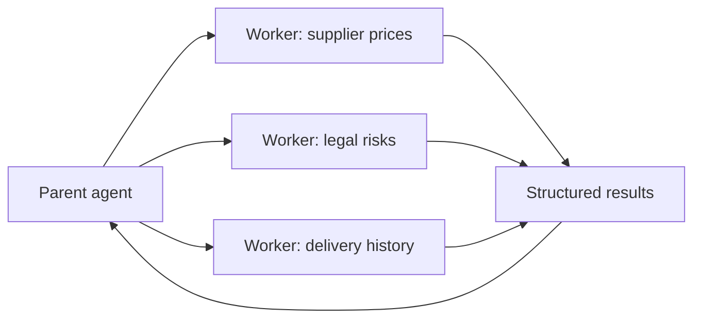

# Primitives 8 and 9: Sub-agents and Skills

These solve different problems.

- A **sub-agent** is a temporary worker with its own context.
- A **skill** is a saved procedure for repeated work.

One splits a large task. The other preserves a good method.

# Part 1: Sub-agents

## Isolation is the real benefit

Suppose one task needs twenty pages of research. Putting all twenty pages, failed searches, and notes into the parent conversation can bury the main goal.

A separate worker gets:

- one clear task
- a small instruction set
- only the required tools and context
- a turn, time, and cost limit
- a required result shape

It returns a compact answer and evidence.



The worker's private history does not automatically enter the parent context.

## From Gemma: a fresh agent per task

Simplified from `~/gemma/harness/subagents.py`

```python
def run_subagent(task: str, *, system=None, model=None, tools=None) -> str:
    worker = Agent(
        system=system or DEFAULT_WORKER_SYSTEM,
        tools=tools or default_tools(),
        model=model,
    )

    return worker.send(task)
```

Fresh construction is the context boundary. The worker does not inherit the parent's long message history.

Gemma also fans out independent tasks with bounded parallelism.

```python
def fan_out(tasks: list[str], max_workers: int = 4) -> list[str]:
    if not tasks:
        return []

    worker_count = min(max_workers, len(tasks))

    with ThreadPoolExecutor(max_workers=worker_count) as pool:
        return list(pool.map(run_subagent, tasks))
```

`pool.map` preserves input order. That makes each result easier to match to its original task.

Threads are only one implementation. Async work, processes, queues, or remote workers can use the same contract.

## Return evidence, not the full transcript

Returning only prose keeps context small but can hide how the worker reached it.

A better result shape is:

```json
{
  "ok": true,
  "answer": "Supplier B is cheapest after shipping.",
  "evidence": [
    {"source": "quote-18", "amount": 840},
    {"source": "quote-21", "amount": 910}
  ],
  "warnings": []
}
```

The parent gets enough to verify the claim without inheriting every dead end.

## When to use a worker

Use one when the task is:

- independent
- context-heavy
- parallelizable
- easier to verify through a small result contract

Do not spawn a worker to read one saved field. That is just an expensive database lookup.

Workers also need limits:

- no uncontrolled recursive delegation
- restricted tools
- total run budget
- cancellation and timeout
- partial-failure handling
- separate credentials where risk demands it

Context isolation is not security isolation. A worker with the same credentials and filesystem authority still has the same blast radius.

# Part 2: Skills

## A skill is a saved recipe

A skill explains how to handle a recurring situation.

```markdown
---
name: review-refund-request
description: Use when a customer disputes a completed charge.
---

1. Load the order and payment event.
2. Check whether the charge was already reversed.
3. Compare the request with refund policy.
4. Draft a decision with evidence.
5. Stop before releasing money.
```

A tool performs one action. A skill explains when and how to combine actions.

| Tool | Skill |
|---|---|
| `get_order(183)` | `review-refund-request` |
| One typed action | A reusable procedure |
| Executed by code | Read and followed by the model |
| Permission belongs to the tool | Safety reminders belong in the recipe too |

## Progressive disclosure

Loading every skill body into every prompt wastes context and causes accidental triggering.

Gemma initially advertises only name, description, and location.

Simplified from `~/gemma/harness/skills.py`

```python
def skills_prompt(skills: list[Skill]) -> str:
    lines = ["Load a skill file when its description matches the task:"]

    lines += [
        f"- {skill.name}: {skill.description} (file: {skill.path})"
        for skill in skills
    ]

    return "\n".join(lines)
```

The model loads the full body only after deciding that the skill applies.

The file path and read tool are implementation details. A product could store procedures in a database or package. The general pattern is:

```text
cheap catalogue first -> full procedure on demand
```

## A useful skill has boundaries

Include:

- when to use it
- when not to use it
- required inputs
- ordered steps
- preferred tools
- expected output
- safety limits
- common failure modes

A vague trigger like "use for customer issues" will load too often. A narrow trigger like "use when a completed card payment is disputed" is easier to select.

## When to create a skill

Create one when:

1. the work repeats
2. the method is mostly stable
3. bad execution has a known pattern
4. a short procedure improves results

Do not turn one-off advice into permanent skill inventory. Skills need owners and review dates because stale procedures can be worse than no procedure.

## HaxJobs case study

Useful future HaxJobs skills might include:

- review profile evidence
- assess a saved job
- build a gap roadmap
- prepare a mock interview

Each skill should use career tools and stop at the same approval gates as every other flow. A skill cannot grant itself extra authority.

## In plain English

- Sub-agents split large independent work into separate contexts.
- Give workers narrow tools, limits, and a structured evidence-bearing result.
- Skills are saved procedures, not executable powers.
- Advertise a small skill catalogue and load full instructions only when needed.
- Add workers and skills after real repeated work proves their value.
