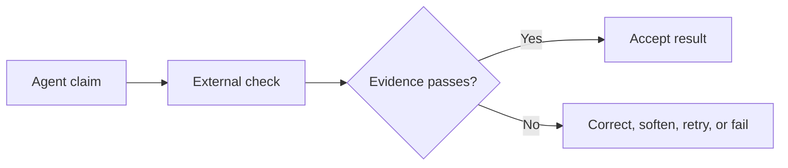
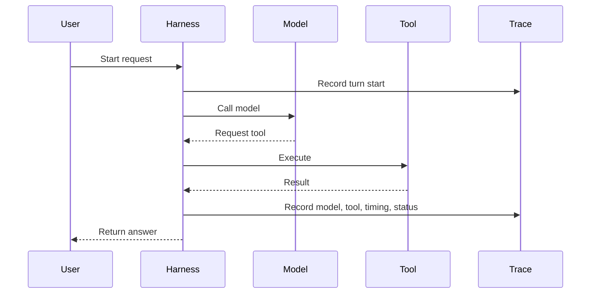

# Primitives 10 and 11: Verification and Observability

Two questions:

1. **Verification:** What outside evidence shows the result is acceptable?
2. **Observability:** What happened during the run?

A confident final sentence answers neither.

# Part 1: Verification

## Completion is a state backed by evidence

If an agent says, "The refund was sent," check the payment provider and saved refund record.

If it says, "This candidate has Kubernetes experience," check the evidence store.

If it says, "The report was created," check the expected artifact and validation result.



The validator should live outside the model response being checked.

## Choose proof that matches the claim

| Claim | Useful receipt |
|---|---|
| Record was saved | Read it back and compare fields |
| Email was sent | Provider message ID and delivery status |
| Price is current | Timestamped provider response |
| Profile claim is safe | Evidence source and verification level |
| Workflow completed | Every required step has a passing state |
| Code change works | Trusted test command exited successfully |

One green check does not prove everything. A passing unit test does not prove a web page works. A file existing does not prove its contents are correct.

## From Gemma: refusing "done" without a receipt

Gemma's coding workflow watches for source changes and requires the repository's declared test command to pass afterward.

Simplified from `~/gemma/harness/agent.py`

```python
for _ in range(self.verify_attempts):
    if self._record_pass(command, turn_start):
        return reply

    self.messages.append({
        "role": "user",
        "content": f"Run {command} and show the real result.",
    })
    reply = self._run(on_delta)

if self._record_pass(command, turn_start):
    return reply

return mark_unverified(reply)
```

The coding details are not universal. The pattern is:

1. detect a state change that needs proof
2. choose a trusted validator
3. run it after the final change
4. capture a structured receipt
5. retry with clear feedback
6. cap attempts
7. fail closed when proof never arrives

Gemma hardens the check so a command printed with `echo`, wrapped with `|| true`, or run before the final edit does not count.

A stronger general system should consume structured tool data directly instead of searching transcript text for words that look like success.

```json
{
  "check": "refund_provider_status",
  "passed": true,
  "checked_at": "2026-07-15T12:30:00Z",
  "receipt_id": "refund_8821",
  "state_version": 17
}
```

## Two gates answer two different questions

Gemma uses two levels of checking:

```text
offline verification: does the code satisfy lint, types, and deterministic tests?
live acceptance: can the real model actually perform the chapter's behaviour?
```

A fake provider is ideal for checking dispatch, error handling, and state transitions. It cannot prove that a real model will select the right tool or follow a procedure. A live model demo can prove that path once, but it is slower and less deterministic.

The general lesson is to keep both:

- fast repeatable engineering checks
- slower behavioural evaluations against the real model and environment

Do not replace the first with demos or the second with mocks.

## Verification should be relevant

Do not run every possible check after every answer.

Arm checks when a meaningful state change or high-risk claim occurs. The trigger itself must be reliable. Gemma's file-extension trigger is fine for teaching but can miss migrations, configuration, schemas, or extensionless scripts.

# Part 2: Observability

## A trace is the run's flight recorder

When an agent fails after six tool calls, the final reply rarely tells you why.

A useful trace records:

- run and turn IDs
- model and prompt version
- selected context sources
- tool names and statuses
- approvals and denials
- retries and errors
- duration
- token usage and cost
- verification receipts
- final state



Observability explains the path. Verification judges the result.

## From Gemma: events plus spans

Gemma records a small event for each model or tool call.

Simplified from `~/gemma/harness/observability.py`

```python
@dataclass
class Event:
    kind: str
    label: str
    seconds: float
    tokens: int = 0
    cost: float = 0.0
    status: str = ""
    turn: int = 0
```

One emitter can feed several consumers:

- live UI
- console
- JSONL
- telemetry collector

Gemma also creates OpenTelemetry-shaped spans so the core is not tied to one tracing product.

Simplified from `~/gemma/harness/events.py`

```python
class SpanExporter(Protocol):
    def export(self, spans: list[Span]) -> None:
        ...


class NullExporter:
    def export(self, spans: list[Span]) -> None:
        return None
```

The no-op exporter matters. Tracing should be optional and testable offline.

## Trace at the controller seams

Instrument the places every run already passes through:

- model client
- tool dispatcher
- approval gate
- planner
- verifier
- persistence boundary

That gives one consistent run tree without every business function inventing a logging format.

```text
run
└── turn 3
    ├── model call
    ├── tool: search_orders
    ├── approval: refund denied
    ├── model call
    └── verification: response saved
```

## Private data needs its own rules

Prompts, tool arguments, and tool results can contain passwords, CV details, customer records, private source code, and payment data.

Gemma keeps message-content capture off by default and clamps tool inputs and outputs in traces. That is a good start.

A real product also needs:

- redaction before storage
- tenant and user access controls
- retention and deletion policy
- sampling for high-volume runs
- sink failure and backpressure rules
- clear distinction between billed cost and estimated cost

A local model may have zero API price but still uses hardware, time, and electricity.

## HaxJobs case study

If discovery returns zero new jobs, a useful trace should show:

```text
Greenhouse: 12 found, 2 matched, 2 duplicates
Ashby: request failed after one retry
Lever: 0 found
Promotion: 0 new rows
```

Now the result is understandable. "Nothing new existed" and "one source failed" are different outcomes.

Fit claims should also link to profile evidence. A score without evidence is only an opinion with a number attached.

## In plain English

- Verification asks for proof outside the model's sentence.
- Observability records the route taken to that sentence.
- Match each claim with the right validator.
- Record model, tool, approval, timing, token, cost, and verification events at shared controller boundaries.
- Keep private prompt and tool content out of traces by default.
- If proof is missing, say unverified. Do not quietly call it done.
