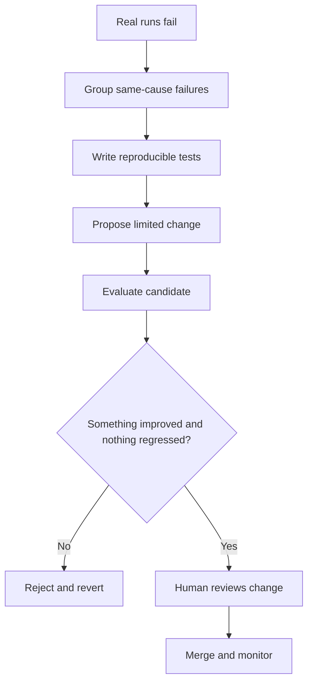
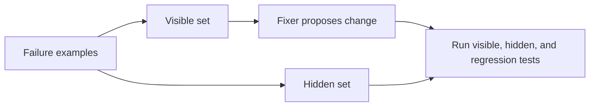

# Primitive 12: Evolution

## Repeated failure should become a tested system change

An agent does not improve because a model promises to remember a correction.

Real improvement happens when the surrounding system:

1. records failures
2. finds a repeatable pattern
3. explains the cause
4. writes a test
5. proposes a limited change
6. checks for regressions
7. waits for human review



The model can stay the same. The rules, retrieval, tool schemas, limits, workflow, or validators around it get better.

## Carbon Layer stops before this step

The Gemma build ends with verification, traces, and a UI. Those are prerequisites for improvement because you need proof and run records before you can diagnose repeated failure.

Gemma does not implement an automatic self-improvement system. Do not describe its tracer or verifier as one.

This primitive comes from the separate self-improving-systems lesson in the vault sources.

## Only fix patterns you can explain

One strange run is not enough.

A useful failure cluster has:

- several examples
- the same visible symptom
- the same underlying cause
- a deterministic way to reproduce it

Example:

```text
Symptom: long customer notes lose the final resolution.
Cause: every note is cut at 4,000 characters from the front.
Evidence: 8 of 8 failures place the resolution after character 4,000.
```

That is worth fixing. "The agent felt weird yesterday" is not ready.

## Two kinds of tests

| Test | Job |
|---|---|
| Failure test | Prove the broken case and later prove the fix |
| Regression guard | Prove that existing good behaviour stayed good |

A candidate that fixes one case while breaking two others is not an improvement.

## Keep some evaluation hidden

If a fixer sees every exact test case, it can overfit the answer.

Split cases:

- **held-in:** visible examples used to understand the bug
- **held-out:** similar hidden examples used after the change



The hidden set asks, "Did you fix the rule, or only this answer?"

## Limit what the fixer may change

Do not give a model the whole repository and say, "Improve yourself."

Define an editable surface:

```json
{
  "max_tool_result_chars": 4000,
  "max_turns": 5,
  "request_timeout_seconds": 60
}
```

Then allow candidate changes only to named settings or files.

```python
ALLOWED_SETTINGS = {
    "max_tool_result_chars",
    "max_turns",
}


def change_is_allowed(change: dict) -> bool:
    return set(change) <= ALLOWED_SETTINGS
```

This keeps the fixer away from test answers, approval gates, credentials, and unrelated product code.

## Test candidates in disposable state

Each candidate should leave no trace unless accepted.

```python
def evaluate_candidate(change: dict) -> bool:
    temporary_state = create_disposable_copy()
    apply_change(temporary_state, change)
    results = run_evaluation_suite(temporary_state)
    destroy(temporary_state)

    return results.nothing_regressed and results.something_improved
```

The strict acceptance rule is useful:

```text
nothing gets worse
and
at least one measured thing gets better
```

Inspect per-task results, not only one aggregate score. A lucky improvement in a flaky task can hide damage elsewhere.

## Review the tests too

Tests can contain loopholes.

Ask:

- Can this pass if the agent does nothing?
- Can the fixer rewrite the expected answer?
- Does the test check the actual outcome or only confident wording?
- Are seeded files protected from mutation?
- Is randomness hiding regressions?

A separate adversarial review of the evaluation setup can catch these problems before candidate changes run.

## Rollback is normal

A self-changing system needs a first-class rollback path.

Every accepted change should record:

- old version
- new version
- reason
- evaluation results
- approver
- rollback command or artifact

If a system cannot explain what changed, it is drifting rather than improving.

## Human merge gate

A passing candidate should produce a reviewable proposal, not silently deploy itself.

The review should state:

- repeated failure being fixed
- allowed surface changed
- exact change
- visible and hidden results
- regressions checked
- remaining risks

The machine can propose and test. A person still decides whether product behaviour changes.

## HaxJobs case study

Suppose discovery repeatedly misses "Platform Engineer" roles because the classifier only recognises "Backend Engineer."

The loop should collect missed examples, prove the shared cause, add visible and hidden title cases, test a narrow classification change, check false positives, and wait for review.

Randomly adding more keywords after every complaint would create drift.

## In plain English

- Evolution means tested changes to the system around the model.
- Fix repeatable same-cause failures, not one-off vibes.
- Keep hidden tests and regression guards.
- Let fixers touch only a small declared surface.
- Reject and erase bad candidates.
- Passing changes still wait for a human.
